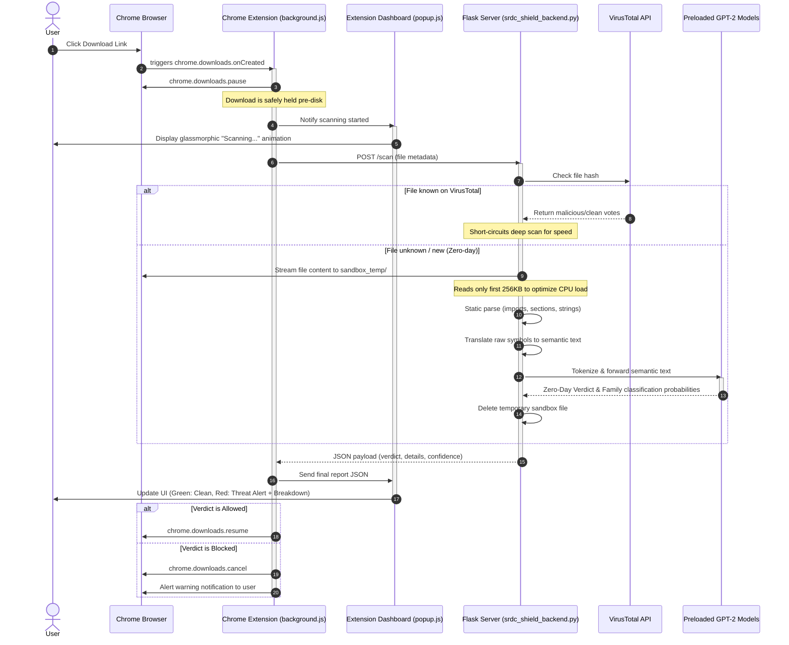

# SRDC Shield: Cognitive Zero-Day Ransomware Interceptor

SRDC Shield is a complete end-to-end security solution implementing a **Semantics-based Ransomware Detection and Classification (SRDC)** architecture. It combines a Chrome Extension frontend (MV3 Service Worker) that intercepts downloads pre-disk with a local Python Flask backend running fine-tuned, GPU-optimized (loaded on CPU) GPT-2 language models to classify zero-day ransomware based on static behavioral semantic extraction.

---

## 📖 Table of Contents
1. [The Big Picture](#-the-big-picture)
2. [Key Features & Highlights](#-key-features--highlights)
3. [Architecture Overview](#-architecture-overview)
4. [Project Structure](#-project-structure)
5. [Installation & Setup](#-installation--setup)
6. [How to Use & Test](#-how-to-use--test)
7. [Deep Technical Details](#-deep-technical-details)

---

## 🌟 The Big Picture

### The Problem
Traditional antivirus software relies on **static signatures** (like digital fingerprints). If a malicious actor tweaks a single line of code, the file hash changes, bypassing traditional firewalls. This is a **Zero-Day Attack**.

### The Solution
Instead of executing the file (risking infection) or relying on static hashes, **SRDC Shield** statically reads the file's "blueprint" (import tables, registry requests, embedded strings) using the `pefile` parser. It translates these raw binary components into natural language sentences describing the program's intent. A fine-tuned domain-specific **GPT-2 Model (`zhouce/RDC-GPT`)** evaluates these sentences to detect if the file behaves like ransomware, blocking it *before* it can write to the user's hard drive.

---

## 🚀 Key Features & Highlights

*   **Pre-Disk Interception**: Freezes downloads in the Chrome browser (in a `.crdownload` state) prior to local filesystem write.
*   **Dual-Layer Defense**:
    *   **Layer 1 (VirusTotal API)**: Fast signature verification for known malware hashes.
    *   **Layer 2 (Cognitive Semantic AI)**: Domain-specific fine-tuned GPT-2 models for analyzing unknown zero-day threats.
*   **MaxPooling Neural Architecture**: Processes PE components as 7 parallel semantic channels, compressing the embeddings via 1D adaptive max-pooling to preserve key features and bypass GPT-2 sequence limits.
*   **Privacy Preserving**: The entire AI inference pipeline runs locally on the user's CPU—no user files are uploaded to third-party cloud servers.
*   **Aggressive Threat Containment**: Automatically blocks downloads and purges sandboxed files upon detecting malicious signatures.

---

## 📐 Architecture Overview

The system consists of three main parts:
1.  **Chrome Extension (Frontend Interceptor)**: Listens for `chrome.downloads.onCreated`, pauses the stream, and issues a POST scan request to the backend.
2.  **Flask Backend (Local Coordinator)**: Accepts scan requests, queries VirusTotal, runs sandboxed extraction, and forwards the parsed semantic channels to the model.
3.  **Cognitive AI Layer (PyTorch CPU)**: Preloads binary zero-day and multi-class ransomware family classification models on startup for instant inference (<0.25 seconds).

### Sequence Flow:


---

## 📂 Project Structure

```directory
DOMAIN-PRO-SRDC/
├── PHASE2/                                     # Pre-trained Model Weights
│   ├── srdc_family_BEST.pth                    # Multiclass model (12 ransomware families)
│   └── srdc_zero_day_BEST.pth                  # Binary model (Goodware vs Ransomware)
│
├── project/SRDC/                               # Model Training & Dataset Codebase
│   ├── Feature_Internal_Semantic_Processing/   # Scripts to preprocess PE features
│   ├── Ransomware_Family_Classification/       # Scripts/Notebooks for multiclass training
│   ├── ZeroDay_Ransomware_Detection/           # Scripts/Notebooks for binary detection training
│   ├── FineTuned_SRDC.ipynb                    # Notebook detailing GPT-2 fine-tuning steps
│   ├── srdc_maxpooling_training.py             # Script for train/val of MaxPooling model
│   └── srdc_training_final.ipynb               # End-to-end model evaluation notebook
│
├── srdc-shield-extension/                      # Chrome Extension (Manifest V3)
│   ├── background.js                           # Background service worker (pauses & queries backend)
│   ├── manifest.json                           # Extension permissions and config
│   ├── popup.html                              # Sleek glassmorphic user dashboard
│   ├── popup.js                                # Connects popup UI with background service worker
│   └── popup.css                               # High-quality dark styling & animations
│
├── sandbox_temp/                               # Directory used for safe download streaming
├── srdc_shield_backend.py                      # Flask API backend coordinating VT & PE scans
├── architecture_diagram.md                     # High-level architecture specification
├── finale.txt                                  # Review preparation guide (cheat sheet)
└── README.md                                   # This documentation file
```

---

## ⚙️ Installation & Setup

### 1. Prerequisites
*   **Python 3.8+** installed.
*   **Google Chrome** browser installed.
*   GPU is optional; model weights preload directly onto the CPU.

### 2. Backend Installation
Clone or navigate to the directory and install dependencies:
```bash
pip install torch transformers pefile flask flask-cors requests
```

### 3. Startup the Backend
Start the local Flask analysis server:
```bash
python srdc_shield_backend.py
```
Upon running, you should see logs indicating that the Zero-Day and Family Classification models are preloading into CPU memory. The server will run at: `http://127.0.0.1:5000`

### 4. Chrome Extension Installation
1.  Open Google Chrome and navigate to `chrome://extensions/`.
2.  Enable **Developer mode** (toggle in the top-right corner).
3.  Click **Load unpacked** in the top-left.
4.  Select the `srdc-shield-extension` folder from this repository.
5.  Pin the **SRDC Shield** extension to your toolbar.

---

## 🧪 How to Use & Test

### Active Scanning
Once the extension and backend are running:
*   Initiate a download for any `.exe` or `.zip` file from the web.
*   Click the extension icon to open the glassmorphic dashboard.
*   The dashboard will show a loading animation saying `Scanning...` while the backend processes the file.
*   Once done, the extension will display the results (Verdict, Confidence score, Ransomware family breakdown, and behavioral reasons for flagging).

### Zero-Day Simulation Mode
To demonstrate behavior safely without downloading real malware, download a URL containing `simulate_zero_day` (e.g., `http://example.com/simulate_zero_day`).
*   The extension will intercept this request.
*   The backend will bypass download, load mock ransomware semantic features, run local PyTorch inference, and flag it as `Ransomware` (CryptoWall / Locker family).
*   The extension will display a red alert interface, showing explanation triggers such as:
    *   *Imports CryptEncrypt (encryption operations)*.
    *   *Modifies Windows boot registry for automatic startup persistence*.

---

## 🛠️ Deep Technical Details

### 1. The 7 PE Feature Channels
The semantic parser parses the first 256KB of the target executable and aggregates features into 7 distinct channels:
1.  **API Calls**: Core Windows functions mapped to plain-English equivalents (e.g., `RegSetValueEx` ➡️ `reg set value`).
2.  **Dropped Files**: Extensions of newly written files.
3.  **Registry Modifications**: Modifications to `HKEY_CURRENT_USER`, auto-startup keys, etc.
4.  **File Operations**: Creation, modification, and deletion signatures.
5.  **File Extensions**: Associated extensions.
6.  **Directory Enumeration**: Attempts to list personal directories (Documents, Desktop).
7.  **Embedded Strings**: Embedded strings pointing to ransomware behavior.

### 2. Hierarchical MaxPooling Neural Network
```
Raw Executable ➡️ Extract 7 Channels ➡️ Tokenize Separately ➡️ GPT-2 Forward Pass ➡️ AdaptiveMaxPool1d ➡️ Concatenate ➡️ Linear Layer ➡️ Verdict
```
In traditional NLP classification, raw feature lists are flat-concatenated into a single sequence, resulting in loss of sequence structure and truncation.
Our model uses a custom `MaxPoolingClassifier`:
*   Inputs are tokenized into 7 sub-sequences of shape `(batch, 7, 1024)`.
*   Each channel is run independently through `GPT2Model` to extract semantic hidden states.
*   We apply `AdaptiveMaxPool1d` along the sequence dimension, compressing the representation by a factor of 64 while maintaining the strongest semantic signals.
*   The output layer maps the combined embeddings to the target classes:
    *   `srdc_zero_day_BEST.pth`: 2 classes (Goodware, Ransomware)
    *   `srdc_family_BEST.pth`: 12 classes representing specific ransomware strains: *Citroni, CryptLocker, CryptoWall, Kollah, Kovter, Locker, Matsnu, PGPCODER, Reveton, TeslaCrypt, Trojan-Ransom*.
