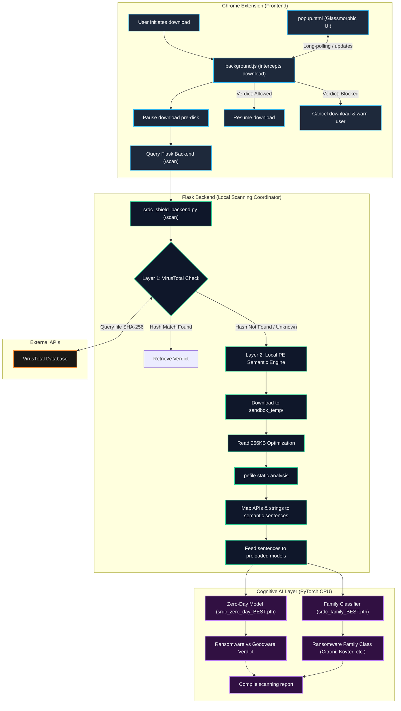
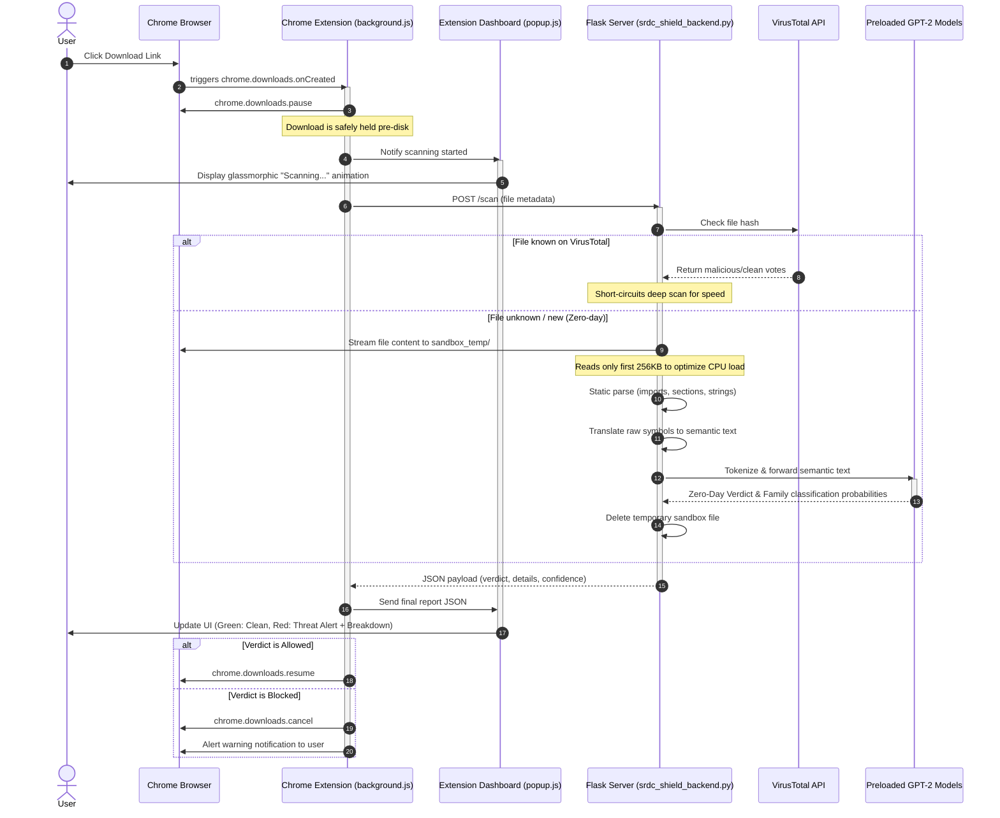

# SRDC Shield Architecture Diagram & Design Specification

This document provides a comprehensive blueprint of **SRDC Shield**—a Chrome extension paired with a local Flask backend implementing a dual-layer ransomware detection engine. 

---

## 1. High-Level Architecture Flowchart

The following flowchart visualizes the sequence of operations from a user initiating a download to the browser either resuming or canceling the download based on the security verdict.

---

## 2. Sequence Diagram: Step-by-Step Data Flow

The diagram below details the chronological request-response lifecycle when a file is intercepted.

---

## 3. Detailed Component Breakdown

### 3.1 Chrome Extension (MV3)
* **Manifest (`manifest.json`)**: Configured with MV3, requesting `downloads`, `downloads.shelf`, and `declarativeNetRequest` permissions. It registers `background.js` as a background service worker.
* **Service Worker (`background.js`)**: Captures downloads, pauses them, performs the HTTP POST to localhost:5000, and resumes/cancels based on the scanning report.
* **Dashboard (`popup.html` / `popup.js` / `popup.css`)**: Built with a sleek, premium dark-theme layout using CSS glassmorphism, responsive flex layouts, and custom fonts. It renders plain-English descriptions of why particular APIs are suspicious (e.g. mapping `CryptEncrypt` to ransomware behaviors).

### 3.2 Flask Backend Coordination
* **Secure Sandbox (`sandbox_temp/`)**: Temporary directory configured at root where files are temporarily streamed during Layer 2 analysis.
* **256KB Scan Optimization**: To ensure near-instantaneous CPU scans, the backend reads only the first 256KB of the target file. This is sufficient to capture headers, import tables, and initial resource strings where PE malware features are stored.
* **VirusTotal API Check (Layer 1)**: Computes the SHA-256 hash of the incoming file and queries the VirusTotal database. If the file is already flagged/cleared, it returns immediately without running the deep model.

### 3.3 Semantic Translation & Model Inference (Layer 2)
* **Semantic Parser**: Translates raw camelCase Windows APIs to natural, lowercased, space-separated word combinations (e.g. `RegSetValueEx` ➡️ `reg set value`). Suspicious strings and file system changes are mapped to readable text.
* **Preloaded PyTorch Models**:
  - `srdc_zero_day_BEST.pth`: A binary classifier fine-tuned on the `zhouce/RDC-GPT` architecture to detect ransomware vs goodware.
  - `srdc_family_BEST.pth`: A 12-class classifier evaluating the exact ransomware family signature (Citroni, CryptLocker, Kovter, Reveton, TeslaCrypt, etc.).
  - Running on CPU with cached preloading to complete scans in under **0.25 seconds** once initialized.
